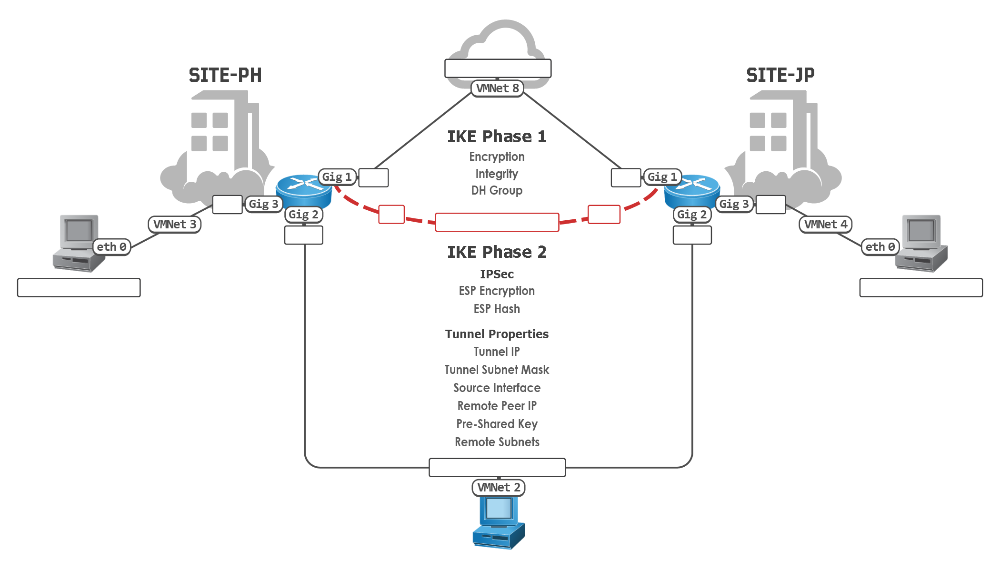

task1: how to qualify for any cybersecurity jobs even if your not qualified.
pretend your qualified: fake it, till you make it

L2/L3/L4: soc
soc.cybersec31.com/otrs/index.pl
root@localhost
C1sc0123

L1:
soc.cybersec31.com/otrs/customer.pl
user1
C1sc0123

task2: know the services at msp and soc
Secure LAN/WLAN Deployment
Managed Detection & Response
Co-Managed SOC (SIEM)
Penetration Testing
Databse Security
Digital Forensics & Incident Response
Firewall & Technology Management

ac@resortworld.com

FINAL TASK: HOW TO SHIFT TO A CYBER SECURITY CAREER
STEP 1: 20/80 RULE
20% leads to six figure salary.
rule1: you and your networkl = salary
Linkdn add 5 to10 SOC connections

step2: our youtube playlist = your salary
david bombal
team rivan

step3: VMware your success

robert victor - fb
rivancorp@outlook.com
0949376000
fortinet, paloalto, cisco, wifi
